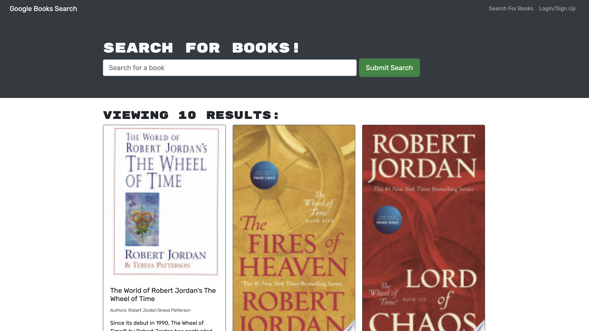

# Book Search Engine

## Description
An app that allows users to search for new books and keep a wishlist of books to purchase later

---

## Deployed Site
[Book Search](https://book-wishlist-app.herokuapp.com/ )

---

---

## Table of Contents

* [Built With](#built-with)
* [User Story](#user-story)
* [Acceptance Criteria](#acceptance-criteria)
* [See It For Yourself](#screenshots)
* [Contact](#contact)

---


## Built With
* ### MERN
    -   
    -   
    -   
    -  
*  
 *   
  *   
  *   
  * 


---


## User Story
```
AS AN avid reader
I WANT to search for new books to read
SO THAT I can keep a list of books to purchase
```
  
## Acceptance Criteria
```
GIVEN a book search engine
WHEN I load the search engine
THEN I am presented with a menu with the options Search for Books and Login/Signup and an input field to search for books and a submit button
WHEN I click on the Search for Books menu option
THEN I am presented with an input field to search for books and a submit button
WHEN I am not logged in and enter a search term in the input field and click the submit button
THEN I am presented with several search results, each featuring a book’s title, author, description, image, and a link to that book on the Google Books site
WHEN I click on the Login/Signup menu option
THEN a modal appears on the screen with a toggle between the option to log in or sign up
WHEN the toggle is set to Signup
THEN I am presented with three inputs for a username, an email address, and a password, and a signup button
WHEN the toggle is set to Login
THEN I am presented with two inputs for an email address and a password and login button
WHEN I enter a valid email address and create a password and click on the signup button
THEN my user account is created and I am logged in to the site
WHEN I enter my account’s email address and password and click on the login button
THEN I the modal closes and I am logged in to the site
WHEN I am logged in to the site
THEN the menu options change to Search for Books, an option to see my saved books, and Logout
WHEN I am logged in and enter a search term in the input field and click the submit button
THEN I am presented with several search results, each featuring a book’s title, author, description, image, and a link to that book on the Google Books site and a button to save a book to my account
WHEN I click on the Save button on a book
THEN that book’s information is saved to my account
WHEN I click on the option to see my saved books
THEN I am presented with all of the books I have saved to my account, each featuring the book’s title, author, description, image, and a link to that book on the Google Books site and a button to remove a book from my account
WHEN I click on the Remove button on a book
THEN that book is deleted from my saved books list
WHEN I click on the Logout button
THEN I am logged out of the site and presented with a menu with the options Search for Books and Login/Signup and an input field to search for books and a submit button  
```
---
## Screenshots
### Home Page View


---
## Contact
Please visit my [GitHub Page](https://github.com/ashryan125/) to check out this and other projects I've been a part of
  
  Contact me at ash.ryan125@gmail.com with any questions or if you'd like to collaborate.


